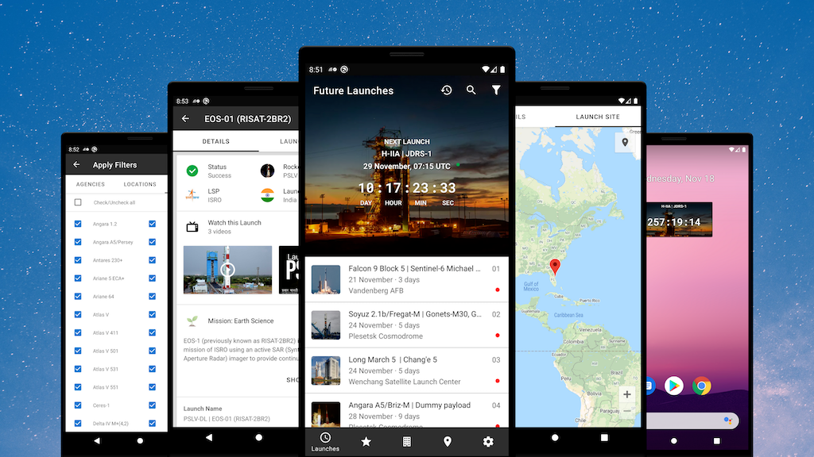

# Space Launch 1

This android app is a capstone project for Udacity android developer nanodegree program. The goal of this project is to apply different concepts and components learned across the nanodegree program while creating and designing an application of choice. 

This repository contains both stages of the capstone project. In stage 1 the purpose is to design the application and produce a design document. In stage 2 the purpose is to build the application based on the design document. 

This application itself is based on [Launch Library API](https://launchlibrary.net/docs/1.4/api.html), and the purpose of the app is to present that launch data in interesting ways. This application is intended for astronomy enthusiasts looking for up-to-date information about upcoming rocket launches.

## App Features

<table>
  <tr>
    <td>
      <ul>
          <li>List of future launches</li>
          <li>List of completed launches</li>
          <li>Filter launches by preference</li>
          <li>View launch details</li>
          <li>Watch launch videos</li>
          <li>Google Maps and Places</li>
          <li>Push notifications</li>
      </ul>
    </td>
    <td>
      <ul>
          <li>Automatic data synchronization</li>
          <li>Homescreen countdown widget</li>
          <li>Responsive design</li>
          <li>Works offline</li>
          <li>Optimized images</li>
          <li>RTL and accessibility support</li>
          <li>Device support: >= Kitkat</li>
      </ul>
    </td>
  </tr>
</table>

## Downloads

Google Play store [here &raquo;](https://play.google.com/store/apps/details?id=io.github.nkrusch.spacelaunchone)

Stage 2: source code is [here &raquo;](https://github.com/nkrusch/SpaceLaunchOne/tree/master/SpaceLaunchOne)

Stage 1: design proposal is [here &raquo;](https://github.com/nkrusch/SpaceLaunchOne/blob/master/docs/Capstone_Stage1.pdf)

## License 

MIT
